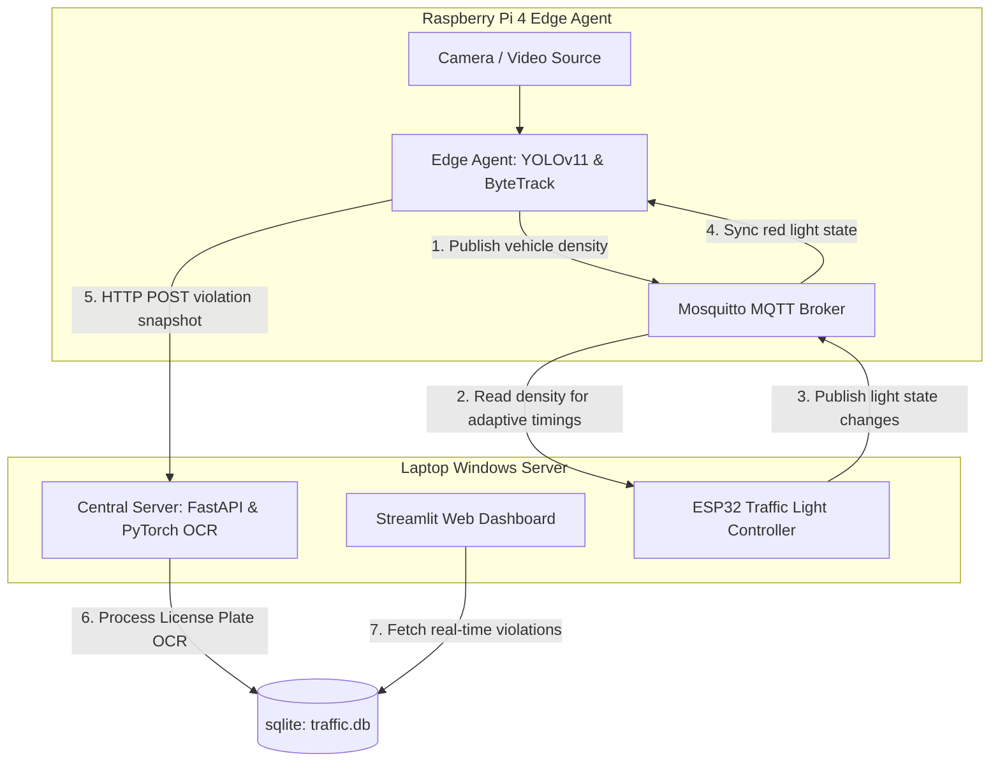

# Intelligent Traffic Monitoring and Control System (YOLOv11 + NCNN + ESP32)

An end-to-end intelligent traffic monitoring system that detects lane-crossing violations during red lights using a high-performance Edge AI pipeline (YOLOv11 + ByteTrack) running on a Raspberry Pi 4. The system communicates via MQTT with an ESP32 microcontroller to adapt traffic light timing in real-time based on density, sends violation snapshots to a Central Laptop Server via HTTP, performs license plate recognition (CRNN OCR), and displays live statistics on a Streamlit Web Dashboard.

---

## 📐 Architecture Overview


---

## 🛠️ Step-by-Step Setup Guide (From Scratch)

This project is split into two components:
1. **💻 Laptop Windows (Central Server):** Runs the FastAPI OCR Server, Streamlit Dashboard, and uploads ESP32 firmware.
2. **🍓 Raspberry Pi 4 (Edge Agent):** Runs the local Mosquitto MQTT Broker and the NCNN Object Detector.

---

### 💻 1. Central Server Setup (Laptop - Windows)

#### Step 1.1: Install Dependencies
Open PowerShell inside the cloned `traffic_monitoring_vn` directory:
1. Create a Python Virtual Environment:
   ```powershell
   python -m venv .venv
   ```
2. Activate the virtual environment:
   ```powershell
   .\.venv\Scripts\Activate
   ```
3. Install required Python packages:
   ```powershell
   pip install --upgrade pip
   pip install -r server/requirements.txt
   pip install streamlit
   ```

#### Step 1.2: Find your Laptop's Local IP Address
Open Command Prompt (`cmd`) and run:
```cmd
ipconfig
```
Locate your **IPv4 Address** (e.g. `172.20.10.2`). This IP will be referenced by the ESP32 and Raspberry Pi.

#### Step 1.3: Start FastAPI and Streamlit Dashboard
Open **two separate terminals**, activate `.venv`, and run:
*   **Terminal 1 (FastAPI Server):**
    ```powershell
    .\.venv\Scripts\Activate
    python server/main.py
    ```
*   **Terminal 2 (Streamlit Dashboard):**
    ```powershell
    .\.venv\Scripts\Activate
    streamlit run server/dashboard.py
    ```
    *Access the Web Dashboard at: http://localhost:8501*

#### Step 1.4: Upload Firmware to ESP32
1. Connect your ESP32 board to the laptop using a micro-USB cable.
2. Edit [credentials.h](file:///d:/traffic_monitoring_vn/esp32/include/credentials.h) to configure your Wi-Fi settings:
   ```cpp
   #define WIFI_SSID "Your_WiFi_Name"
   #define WIFI_PASSWORD "Your_WiFi_Password"
   ```
3. Edit [mqtt_config.h](file:///d:/traffic_monitoring_vn/esp32/include/mqtt_config.h) to configure the MQTT Broker IP address (this is the IP of your Raspberry Pi, e.g. `172.20.10.5`):
   ```cpp
   #define MQTT_BROKER_HOST "172.20.10.5"
   ```
4. Build and upload using PlatformIO inside the `esp32` directory:
   ```powershell
   cd esp32
   pio run -t upload
   pio device monitor
   ```

---

### 🍓 2. Edge Agent Setup (Raspberry Pi 4)

#### Step 2.1: Install & Configure Mosquitto MQTT Broker
On the Raspberry Pi, run the following commands:
1. Install Mosquitto:
   ```bash
   sudo apt update
   sudo apt install -y mosquitto mosquitto-clients
   ```
2. Enable external connections (e.g., from ESP32) and anonymous access:
   ```bash
   sudo nano /etc/mosquitto/mosquitto.conf
   ```
   Add these lines at the bottom:
   ```conf
   listener 1883
   allow_anonymous true
   ```
3. Restart Mosquitto:
   ```bash
   sudo systemctl restart mosquitto
   ```
   *(Retrieve Pi's IP address by running `hostname -I` (e.g., `172.20.10.5`)).*

#### Step 2.2: Setup Virtual Environment & Python Packages
1. Install system prerequisites:
   ```bash
   sudo apt install -y build-essential cmake git libopencv-dev libomp-dev python3-pip python3-venv libvulkan-dev vulkan-tools protobuf-compiler libprotobuf-dev
   ```
2. Create and activate a virtual environment:
   ```bash
   cd ~/traffic_monitoring_vn
   python3 -m venv .venv
   source .venv/bin/activate
   pip install --upgrade pip
   ```
3. **Storage Optimization Tip:** Goining `ultralytics` pulls heavy libraries like PyTorch (`torch`) which takes >1.5GB of disk space. To avoid this, open [edge_pi4/requirements.txt](file:///d:/traffic_monitoring_vn/edge_pi4/requirements.txt) and comment out `ultralytics==8.3.207` (add `#` at the beginning of the line). Then install requirements:
   ```bash
   pip install -r edge_pi4/requirements.txt
   ```
4. Compile NCNN from source for Vulkan/OpenMP hardware acceleration:
   ```bash
   cd ~
   git clone https://github.com/Tencent/ncnn.git
   cd ncnn
   git submodule update --init
   mkdir build && cd build
   cmake -DCMAKE_BUILD_TYPE=Release -DNCNN_VULKAN=ON -DNCNN_SYSTEM_GLSLANG=OFF -DNCNN_DISABLE_RTTI=OFF -DNCNN_OPENMP=ON -DNCNN_BUILD_TOOLS=ON -DNCNN_INSTALL_SDK=ON -DNCNN_BUILD_BENCHMARK=OFF -DNCNN_BUILD_TESTS=OFF -DNCNN_BUILD_EXAMPLES=OFF ..
   make -j4
   sudo make install

   # Link static libraries globally
   sudo mkdir -p /usr/local/lib/ncnn 
   sudo cp -r install/include/ncnn /usr/local/include/
   sudo cp install/lib/libncnn.a /usr/local/lib/ncnn/
   sudo ldconfig

   # Install NCNN python binding in venv
   source ~/traffic_monitoring_vn/.venv/bin/activate
   pip install ncnn
   ```

#### Step 2.3: Configure Server Connections
Edit `shared/configs/settings.yaml` on the Raspberry Pi to set up IP mappings:
```yaml
mqtt:
  broker: "172.20.10.5"   # Raspberry Pi IP
  port: 1883
edge:
  server_host: "172.20.10.2" # Laptop IP
  server_port: 8000
```

#### Step 2.4: Run the Edge Agent
Make sure your virtual environment is activated and launch the NCNN agent:
*   **GUI Mode:**
    ```bash
    python3 edge_pi4/agent_ncnn.py
    ```
*   **Headless Mode (SSH / Console):**
    ```bash
    python3 edge_pi4/agent_ncnn.py --headless
    ```

---

## 🎓 Graduation Thesis Evaluations & Benchmarks (Chương 5)
If you are running evaluations for your thesis report (e.g. testing model accuracy, latency, logging hardware stress tests, plotting telemetry charts), refer to the thesis appendix document:
👉 [phu_luc_huong_dan_van_hanh.md](file:///d:/traffic_monitoring_vn/results/Viet_bao_cao/phu_luc_huong_dan_van_hanh.md)
