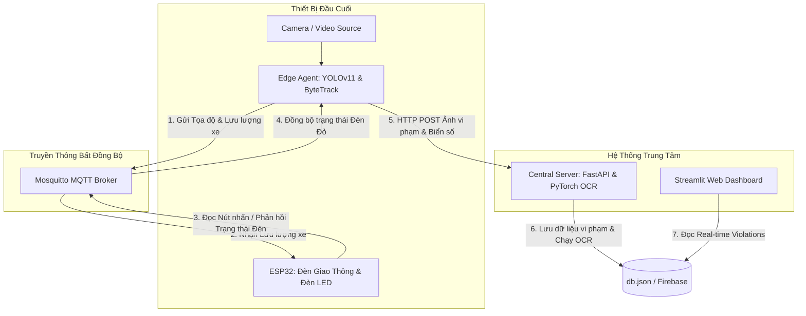

# HỆ THỐNG GIÁM SÁT GIAO THÔNG THÔNG MINH - HƯỚNG DẪN CÀI ĐẶT TOÀN DIỆN
Hệ thống tích hợp AI giám sát phương tiện lấn làn đè vạch đèn đỏ, đếm lưu lượng xe thích ứng để tự động điều chỉnh thời gian đèn giao thông trên ESP32, đồng thời nhận diện biển số (OCR) gửi về máy chủ trung tâm và hiển thị lên Dashboard.

---

## 📐 Kiến Trúc Tổng Quan


---

## 🛠️ Hướng Dẫn Cài Đặt Chi Tiết Từng Thành Phần

### 1. Central Server (FastAPI) & Web Dashboard (Streamlit)
Thành phần này chịu trách nhiệm chạy OCR nhận diện biển số xe vi phạm và cung cấp giao diện Web Dashboard giám sát cho cảnh sát.

#### Bước 1.1: Tạo môi trường ảo Python và cài đặt thư viện
Từ thư mục gốc dự án (`traffic_monitoring_vn`):
```powershell
# 1. Tạo môi trường ảo nếu chưa có
python -m venv .venv

# 2. Kích hoạt môi trường ảo (Windows)
.\.venv\Scripts\Activate
# Hoặc trên Linux: source .venv/bin/activate

# 3. Cài đặt các thư viện cần thiết cho Server
pip install -r server/requirements.txt

# 4. Cài thêm streamlit để chạy Dashboard
pip install streamlit
```

#### Bước 1.2: Chuẩn bị mô hình AI
Đảm bảo các mô hình nhận diện biển số và OCR đã được đặt đúng vị trí:
* Phát hiện biển số: `shared/models/license_best.pt`
* Nhận diện ký tự OCR: `shared/models/ocr_crnn.pt`

#### Bước 1.3: Khởi chạy
* **Chạy Central Server (API):**
  ```powershell
  python server/main.py
  ```
  *(Mặc định chạy tại port 8000: http://localhost:8000)*
  
* **Chạy Web Dashboard (Mở một Terminal mới):**
  ```powershell
  # Đảm bảo đã kích hoạt .venv trước
  streamlit run server/dashboard.py
  ```
  *(Giao diện Web hiển thị tại: http://localhost:8501)*

---

### 2. ESP32 (Phần Cứng & Logic Đèn Giao Thông)
Điều khiển đèn tín hiệu của ngã tư (4 đèn giao thông chạy đồng bộ 2 pha) và điều chỉnh thời gian đèn xanh thích ứng theo lưu lượng xe nhận từ MQTT.

#### Bước 2.1: Yêu cầu cài đặt
* Cài đặt **VS Code** và tiện ích mở rộng **PlatformIO IDE**.
* Kết nối bo mạch ESP32 vào máy tính qua cáp USB truyền dữ liệu.

#### Bước 2.2: Cấu hình thông số kết nối Wi-Fi & MQTT
Mở tệp [esp32/include/globals.h](file:///d:/traffic_monitoring_vn/esp32/include/globals.h) và sửa cấu hình Wi-Fi phù hợp với nhà bạn:
```cpp
const char* ssid = "Tên_WiFi_Của_Bạn";
const char* password = "Mật_Khẩu_WiFi";
```

Mở tệp [esp32/include/mqtt_config.h](file:///d:/traffic_monitoring_vn/esp32/include/mqtt_config.h) và điền địa chỉ IP máy chủ MQTT Broker của bạn:
```cpp
#define MQTT_BROKER_HOST "172.20.10.5" // Đổi thành IP thực tế của Broker
```

#### Bước 2.3: Biên dịch và nạp chương trình (Upload)
Mở Terminal tại thư mục `esp32` và chạy lệnh:
```powershell
# Biên dịch và nạp code
pio run -t upload

# Mở cổng Serial Monitor để theo dõi log hoạt động
pio device monitor
```

---

### 3. Edge Agent (PC / Windows Simulator - Dành cho Test nhanh)
Cho phép chạy mô phỏng camera AI trên máy tính cá nhân sử dụng mô hình PyTorch trước khi đóng gói lên Raspberry Pi.

#### Bước 3.1: Cài đặt thư viện AI cho PC
Cần cài đặt PyTorch, Supervision và các thư viện hỗ trợ (nếu chưa cài):
```powershell
pip install torch torchvision --index-url https://download.pytorch.org/whl/cu118 # CUDA nếu có GPU
# Hoặc bản CPU: pip install torch torchvision
pip install ultralytics supervision paho-mqtt pyyaml opencv-python
```

#### Bước 3.2: Chuẩn bị dữ liệu mô phỏng
1. Copy video mô phỏng ra thư mục gốc:
   ```powershell
   Copy-Item Vehicle_Tracking/vehicle_counting.mp4 .
   ```
2. Cấu hình IP và nguồn video trong tệp [shared/configs/settings.yaml](file:///d:/traffic_monitoring_vn/shared/configs/settings.yaml):
   * Sửa `camera_source: "vehicle_counting.mp4"` (hoặc đường dẫn tới USB camera).
   * Sửa `mqtt.broker` và `edge.server_host` trùng khớp với IP thực tế của máy chạy MQTT và Central Server.

#### Bước 3.3: Chạy Agent
```powershell
python edge_pi4/agent_pt.py
```

---

### 4. Edge Agent (Raspberry Pi 4 - Triển Khai Thực Tế)
Để chạy mô hình tối ưu hóa sâu bằng **NCNN C++** đạt tốc độ **22-25 FPS** trên CPU ARM của Pi 4, vui lòng xem hướng dẫn chi tiết tại tệp:
👉 [edge_pi4/README.md](file:///d:/traffic_monitoring_vn/edge_pi4/README.md)
