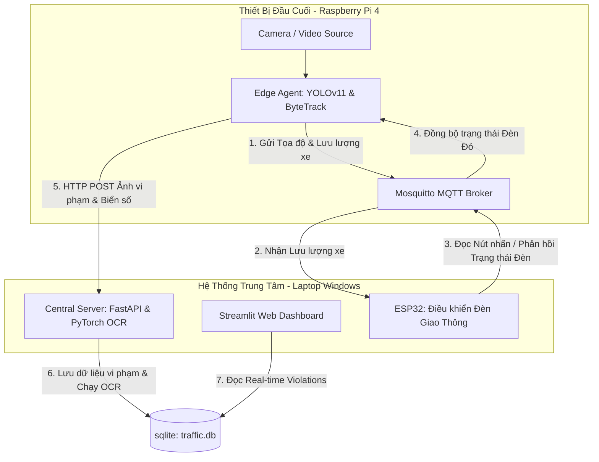

# HỆ THỐNG GIÁM SÁT GIAO THÔNG THÔNG MINH - HƯỚNG DẪN CÀI ĐẶT & THỰC NGHIỆM ĐỒ ÁN TỐT NGHIỆP
Hệ thống tích hợp AI giám sát phương tiện lấn làn đè vạch đèn đỏ, đếm lưu lượng xe thích ứng để tự động điều chỉnh thời gian đèn giao thông trên ESP32, đồng thời nhận diện biển số (OCR) gửi về máy chủ trung tâm và hiển thị lên Web Dashboard.

Tài liệu này cung cấp hướng dẫn cài đặt từ A đến Z dành cho người mới bắt đầu (sau khi `git clone`) và hướng dẫn chạy các kịch bản thực nghiệm thu thập số liệu, biểu đồ phục vụ viết **Báo cáo Đồ án Tốt nghiệp (Chương 5)**.

---

## 📐 Kiến Trúc Tổng Quan Hệ Thống Phân Tán


---

## 💻 PHẦN 1: HƯỚNG DẪN CÀI ĐẶT & KHỞI CHẠY TRÊN LAPTOP (WINDOWS)

Laptop đóng vai trò là Central Server (chạy FastAPI nhận diện biển số xe qua OCR), giao diện giám sát (Streamlit Web Dashboard) và kết nối nạp code cho ESP32.

### Bước 1.1: Chuẩn bị môi trường Python trên Laptop
Mở PowerShell tại thư mục gốc dự án (`traffic_monitoring_vn`):
1. **Tạo môi trường ảo Python:**
   ```powershell
   python -m venv .venv
   ```
2. **Kích hoạt môi trường ảo:**
   ```powershell
   .\.venv\Scripts\Activate
   ```
   *(Bạn sẽ thấy chữ `(.venv)` xuất hiện ở đầu dòng lệnh).*
3. **Cài đặt các thư viện phụ thuộc:**
   ```powershell
   pip install --upgrade pip
   pip install -r server/requirements.txt
   pip install streamlit
   ```

### Bước 1.2: Xác định Địa chỉ IP của Laptop
Mở Command Prompt (`cmd`) hoặc PowerShell, chạy lệnh:
```cmd
ipconfig
```
Tìm địa chỉ **IPv4 Address** của card mạng đang kết nối mạng (Ví dụ: `172.20.10.2`). Ghi lại IP này để cấu hình cho ESP32 và Raspberry Pi ở phần sau.

### Bước 1.3: Khởi chạy FastAPI Server & Streamlit Dashboard
Mở **hai cửa sổ Terminal riêng biệt**, kích hoạt `.venv` và khởi chạy các lệnh sau:
* **Terminal 1 (FastAPI Server):**
  ```powershell
  .\.venv\Scripts\Activate
  python server/main.py
  ```
  *(Server sẽ lắng nghe tại cổng 8000: http://localhost:8000. Bạn có thể kiểm tra Swagger UI tại http://localhost:8000/docs).*

* **Terminal 2 (Streamlit Dashboard):**
  ```powershell
  .\.venv\Scripts\Activate
  streamlit run server/dashboard.py
  ```
  *(Dashboard quản lý vi phạm sẽ hiển thị tại: http://localhost:8501).*

---

### Bước 1.4: Cấu hình, Nạp code và Giám sát ESP32
1. Kết nối mạch ESP32 vào cổng USB Laptop qua cáp dữ liệu.
2. Mở file [credentials.h](file:///d:/traffic_monitoring_vn/esp32/include/credentials.h):
   * Sửa dòng `#define WIFI_SSID "Tên_WiFi"` -> Nhập tên Wi-Fi nhà bạn.
   * Sửa dòng `#define WIFI_PASSWORD "Mật_Khẩu"` -> Nhập mật khẩu Wi-Fi.
3. Mở file [mqtt_config.h](file:///d:/traffic_monitoring_vn/esp32/include/mqtt_config.h) và điền IP của **MQTT Broker** (theo cấu hình chạy trên Raspberry Pi là `172.20.10.5`):
   ```cpp
   #define MQTT_BROKER_HOST "172.20.10.5"
   ```
4. Mở Terminal trong VS Code với PlatformIO tại thư mục `esp32` và tiến hành nạp code:
   ```powershell
   cd esp32
   pio run -t upload
   pio device monitor
   ```

---

## 🍓 PHẦN 2: HƯỚNG DẪN CÀI ĐẶT & CHẠY TRÊN RASPBERRY PI 4

Raspberry Pi 4 đóng vai trò là Edge Agent thu thập video từ Camera, xử lý AI nhận dạng và chạy cục bộ **MQTT Broker (Mosquitto)**.

### Bước 2.1: Cài đặt và Cấu hình MQTT Broker (Mosquitto) trên Pi
Mở Terminal của Raspberry Pi và thực hiện các lệnh sau:
1. **Cài đặt Mosquitto:**
   ```bash
   sudo apt update
   sudo apt install -y mosquitto mosquitto-clients
   ```
2. **Cấu hình cho phép thiết bị khác kết nối:**
   ```bash
   sudo nano /etc/mosquitto/mosquitto.conf
   ```
   Thêm 2 dòng sau vào cuối tệp:
   ```conf
   listener 1883
   allow_anonymous true
   ```
   *Lưu và thoát (Ctrl+O, Enter, Ctrl+X).*
3. **Khởi động lại dịch vụ:**
   ```bash
   sudo systemctl restart mosquitto
   ```
   *(Xác định IP của Raspberry Pi bằng lệnh `hostname -I` (Ví dụ: `172.20.10.5`)).*

### Bước 2.2: Cài đặt môi trường Python & Biên dịch NCNN trên Pi
1. **Cài đặt các thư viện hệ thống cần thiết:**
   ```bash
   sudo apt install -y build-essential cmake git libopencv-dev libomp-dev python3-pip python3-venv libvulkan-dev vulkan-tools protobuf-compiler libprotobuf-dev
   ```
2. **Tạo môi trường ảo và cài đặt thư viện Python (OpenCV cài nhanh qua pip):**
   ```bash
   cd ~/traffic_monitoring_vn
   python3 -m venv .venv
   source .venv/bin/activate
   pip install --upgrade pip
   pip install -r edge_pi4/requirements.txt
   ```
3. **Biên dịch NCNN SDK từ Kho lưu trữ để tối ưu hóa Vulkan GPU & OpenMP:**
   ```bash
   cd ~
   git clone https://github.com/Tencent/ncnn.git
   cd ncnn
   git submodule update --init
   mkdir build && cd build
   cmake -DCMAKE_BUILD_TYPE=Release -DNCNN_VULKAN=ON -DNCNN_SYSTEM_GLSLANG=OFF -DNCNN_DISABLE_RTTI=OFF -DNCNN_OPENMP=ON -DNCNN_BUILD_TOOLS=ON -DNCNN_INSTALL_SDK=ON -DNCNN_BUILD_BENCHMARK=OFF -DNCNN_BUILD_TESTS=OFF -DNCNN_BUILD_EXAMPLES=OFF ..
   make -j4
   sudo make install

   # Copy thư viện tĩnh vào /usr/local để script check hệ thống nhận diện được
   sudo mkdir -p /usr/local/lib/ncnn 
   sudo cp -r install/include/ncnn /usr/local/include/
   sudo cp install/lib/libncnn.a /usr/local/lib/ncnn/
   sudo ldconfig
   ```
4. **Cài đặt `ncnn` Python Binding trong môi trường ảo:**
   ```bash
   source ~/traffic_monitoring_vn/.venv/bin/activate
   pip install ncnn
   ```

### Bước 2.3: Cấu hình File Kết nối Mạng
Mở tệp `shared/configs/settings.yaml` trên Pi và điền chính xác địa chỉ IP của **MQTT Broker (Pi)** và **FastAPI Server (Laptop)**:
```yaml
mqtt:
  broker: "172.20.10.5"   # Địa chỉ IP của Raspberry Pi 4
  port: 1883
edge:
  server_host: "172.20.10.2" # Địa chỉ IP của Laptop Windows
  server_port: 8000
```

### Bước 2.4: Khởi chạy Edge Agent thực tế
Đảm bảo đã kích hoạt môi trường ảo `.venv` trên Pi và khởi chạy:
* **Chế độ hiển thị màn hình (GUI Mode):**
  ```bash
  python3 edge_pi4/agent_ncnn.py
  ```
* **Chế độ ẩn giao diện (Headless qua SSH):**
  ```bash
  python3 edge_pi4/agent_ncnn.py --headless
  ```

---

## 📊 PHẦN 3: HƯỚNG DẪN CHẠY THỰC NGHIỆM PHỤC VỤ ĐỒ ÁN TỐT NGHIỆP (CHƯƠNG 5)

Thư mục `scripts/` chứa toàn bộ công cụ thực nghiệm tự động để thu thập dữ liệu đo đạc, vẽ biểu đồ hiệu năng sử dụng trực tiếp trong báo cáo Đồ án của bạn.

### Bước 3.1: Kiểm tra nhanh Sức khỏe Hệ thống (Health Check)
Chạy script kiểm tra xem cài đặt OpenCV, NCNN, cấu hình CPU Governor, và kết nối mạng đã chuẩn chưa:
```bash
python3 scripts/check_env_pi.py
```
*Kết quả sẽ hiển thị mã màu ANSI chỉ ra chi tiết các phần cứng đạt tiêu chuẩn (OK) hoặc cảnh báo.*

### Bước 3.2: Đo đạc và So sánh hiệu năng mô hình (PyTorch vs NCNN)
Để thu thập dữ liệu về thời gian nạp mô hình, độ trễ suy luận trung bình (Inference Latency) và FPS lý thuyết:
```bash
python3 scripts/compare_models.py
```
*Kết quả dạng bảng Markdown sẽ tự động ghi đè vào tệp `shared/configs/model_comparison_results.md` để bạn sao chép thẳng vào **Bảng 5.x** trong đồ án.*

### Bước 3.3: Khởi chạy Stress Test và Thu thập Viễn đo (Telemetry Suite)
Đây là kịch bản chạy quan trọng nhất. Hãy chạy script Bash tự động sau để Stress Test hệ thống trong 60 giây:
```bash
bash scripts/run_automated_tests.sh
```
*Script này sẽ thực hiện ngầm:*
1. Chạy quét môi trường hệ thống.
2. Chạy so sánh mô hình (PyTorch vs NCNN) ở kích thước 320 và 480.
3. Chạy đo đạc hiệu năng vi xử lý chi tiết (OpenCV Resize, NMS, ByteTrack, SQLite, MQTT) thông qua `audit.py`.
4. Khởi động Edge Agent ngầm, đồng thời ghi nhận viễn đo hệ thống (Nhiệt độ CPU, RAM tiêu thụ, Tần số xung nhịp, FPS thực tế) vào tệp `telemetry.csv` mỗi 5 giây.
5. Tự động gọi `plot_charts.py` vẽ các biểu đồ báo cáo khoa học sắc nét dạng `.png`.
6. Biên soạn báo cáo tổng hợp kết quả bằng Tiếng Việt tại tệp `BÁO_CÁO_THỰC_NGHIỆM_TỔNG_HỢP.md`.

---

## 📈 LẤY KẾT QUẢ ĐỂ CHO VÀO BÁO CÁO ĐỒ ÁN
Sau khi chạy xong **Bước 3.3**, toàn bộ kết quả đo đạc thực nghiệm sẽ được đóng gói gọn gàng trong thư mục có định dạng tên:
📂 **`results_summary_[MỐC_THỜI_GIAN]/`**

Bạn chỉ cần sao chép thư mục này về Laptop để sử dụng:
1. **Biểu đồ hiệu năng (Chèn vào Chương 5):**
   * `plots/hinh5_2_fps_comparison.png` -> So sánh tốc độ xử lý lý thuyết (FPS) của các phiên bản.
   * `plots/hinh5_3_latency_comparison.png` -> So sánh độ trễ trung bình và trễ P95.
   * `plots/hinh5_4_cpu_temperature.png` -> Biến thiên nhiệt độ CPU qua thời gian (Stress Test).
   * `plots/hinh5_5_ram_usage.png` -> Biến thiên dung lượng RAM sử dụng.
   * `plots/hinh5_6_loop_fps.png` -> Biến thiên tốc độ hiển thị thực tế (Loop FPS).
2. **Báo cáo tổng hợp số liệu:** Mở tệp `BÁO_CÁO_THỰC_NGHIỆM_TỔNG_HỢP.md` để lấy trực tiếp các số liệu trung bình về nhiệt độ vi xử lý, xung nhịp, độ trễ và bảng so sánh hiệu năng điền vào văn bản đồ án.
