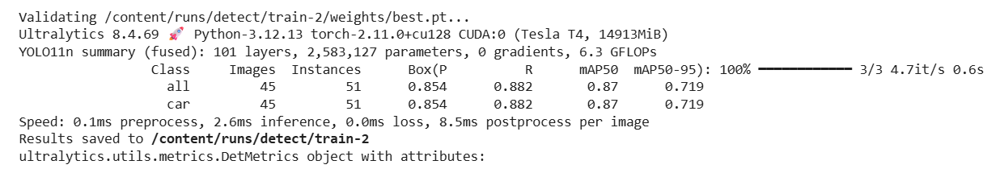
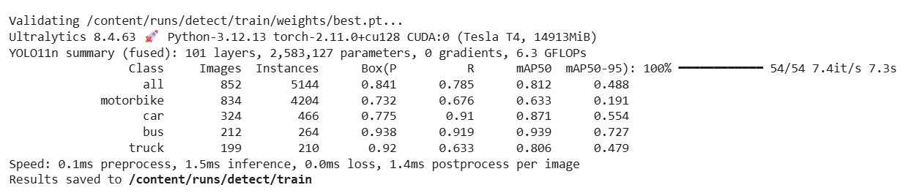
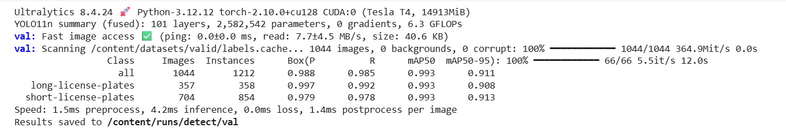
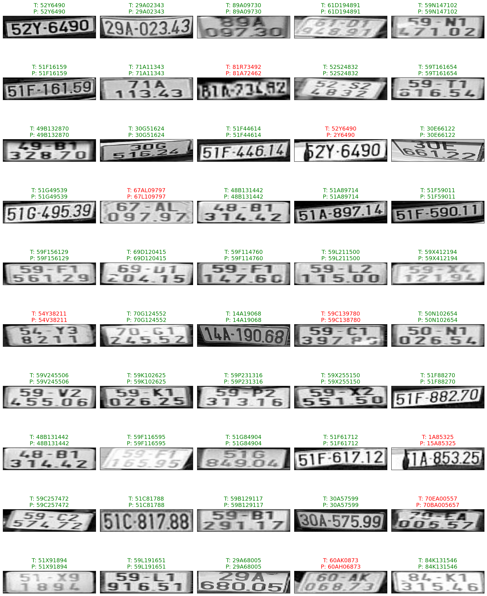
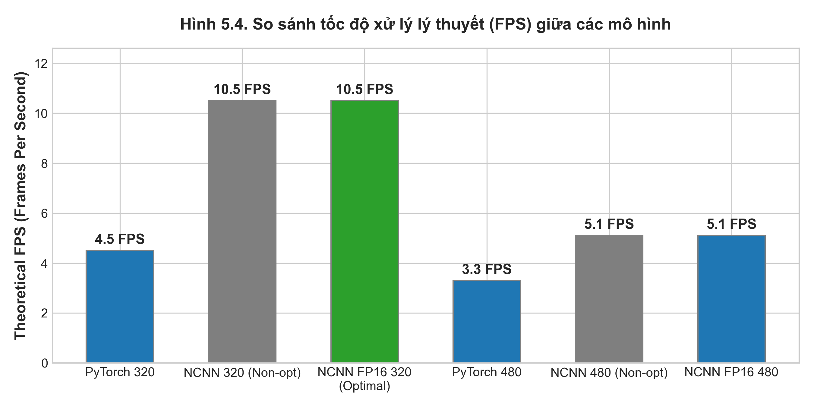
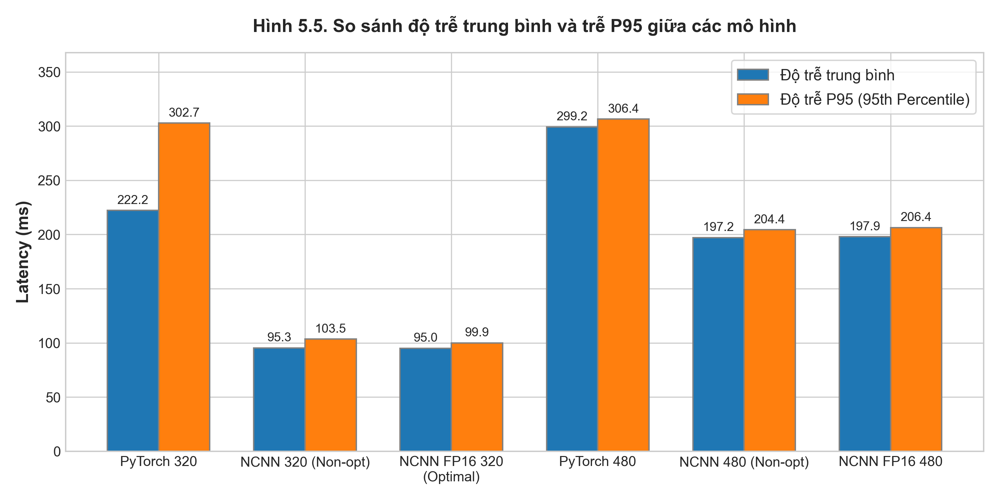
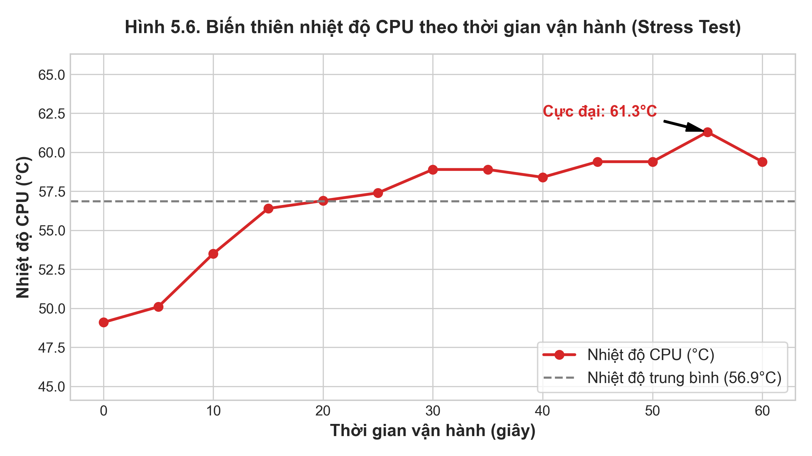
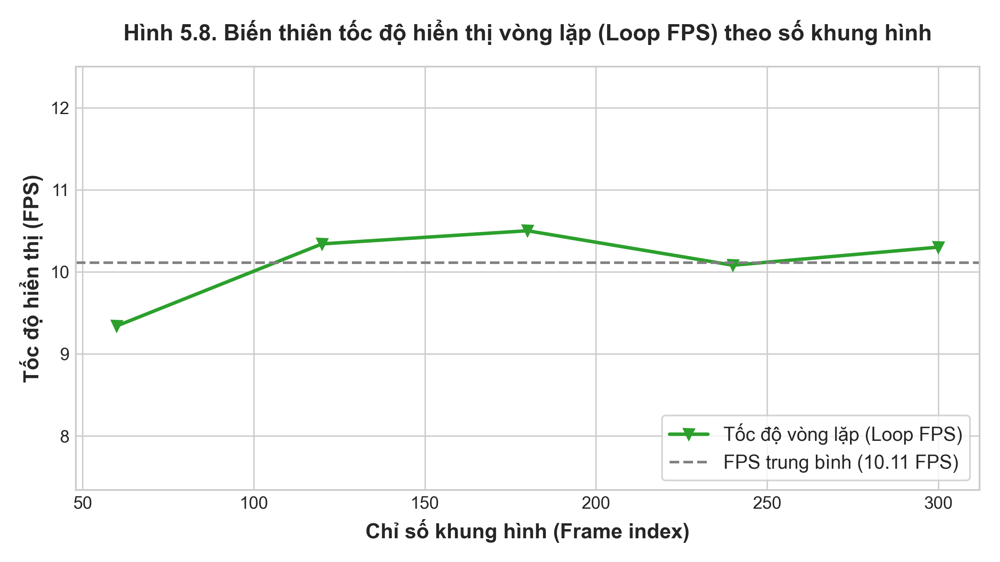
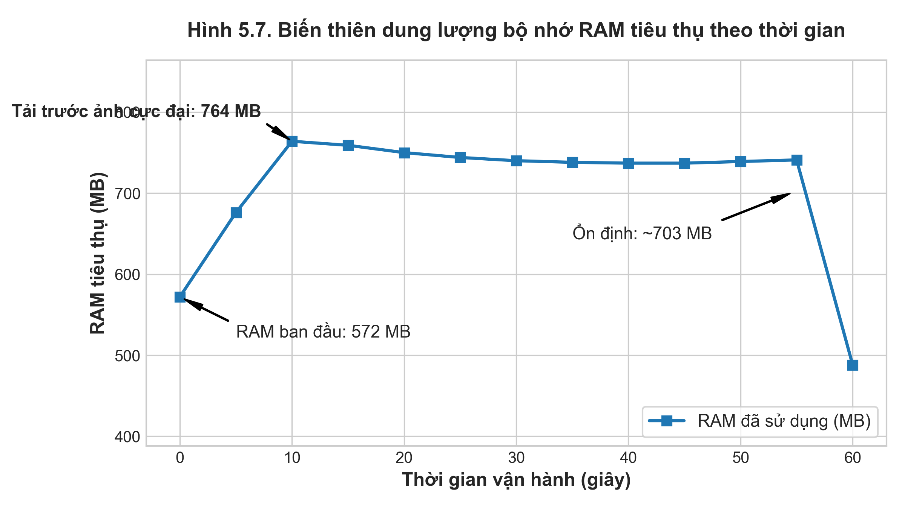
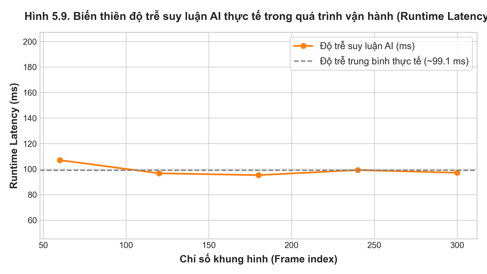

# CHƯƠNG 5: KẾT QUẢ THỰC NGHIỆM VÀ ĐÁNH GIÁ

Chương này trình bày các kết quả thực nghiệm thu được từ quá trình triển khai, vận hành và kiểm thử hệ thống giám sát giao thông thông minh tích hợp công nghệ trí tuệ nhân tạo tại biên (Edge AI) và cơ chế điều khiển đèn tín hiệu thích ứng. Nội dung thực nghiệm tập trung vào các khía cạnh cốt lõi bao gồm: thiết lập môi trường thực nghiệm thực tế; đánh giá chất lượng huấn luyện của các mô hình học sâu chuyên biệt (phát hiện phương tiện giao thông, định vị vùng chứa biển số xe và nhận dạng ký tự biển số); so sánh hiệu năng suy luận trên thiết bị biên giữa framework tối ưu hóa Tencent NCNN và framework PyTorch gốc. Đồng thời, chương này cũng phân tích chi tiết các chỉ số viễn đo (telemetry) về hiệu suất sử dụng tài nguyên hệ thống (nhiệt độ vi xử lý, tần số hoạt động, dung lượng bộ nhớ RAM, tốc độ vòng lặp xử lý ứng dụng) trong quá trình kiểm thử tải giới hạn (Stress Test) và tiến hành xác minh chức năng của toàn hệ thống trong kịch bản vận hành thực tế khép kín từ biên đến trung tâm.

---

## 5.1. THIẾT LẬP MÔI TRƯỜNG THỰC NGHIỆM

Để đánh giá chính xác hiệu năng tính toán và khả năng ứng dụng thực tế của đề tài, một hệ thống thực nghiệm đồng bộ giữa phần cứng và phần mềm đã được thiết lập. Kiến trúc thực nghiệm bao gồm thiết bị xử lý tại biên (Edge Agent), cụm điều khiển đèn tín hiệu giao thông (Traffic Light Controller) và máy chủ trung tâm (Central Server) được liên kết chặt chẽ thông qua mạng truyền thông bất đồng bộ.

### 5.1.1. Thiết bị phần cứng hệ thống

Thành phần xử lý tại biên đóng vai trò thu nhận luồng dữ liệu hình ảnh thời gian thực từ camera giám sát, thực hiện các thuật toán nhận diện, theo dõi phương tiện và phát hiện hành vi vi phạm tại thực địa. Các thiết bị phần cứng được cấu hình chi tiết như sau:
*   **Thiết bị biên xử lý trí tuệ nhân tạo (Edge Agent):** Sử dụng máy tính nhúng Single Board Computer (SBC) Raspberry Pi 4 Model B (Revision 1.5). Thiết bị sở hữu vi xử lý Broadcom BCM2711 gồm 4 nhân ARM Cortex-A72 (ARMv8) 64-bit. Để đảm bảo năng lực tính toán tối đa cho các tác vụ suy luận học sâu mà không bị trồi sụt do cơ chế tiết kiệm năng lượng, xung nhịp của CPU được thiết lập ép xung nhẹ ổn định ở mức 1800 MHz thông qua cấu hình hệ thống, đồng thời kích hoạt trình điều phối xung nhịp CPU ở chế độ hiệu năng cao (`performance governor`). Thiết bị được trang bị bộ nhớ RAM dung lượng 4GB LPDDR4-3200, đáp ứng đủ băng thông truyền dữ liệu giữa các phân hệ xử lý ảnh.
*   **Bộ điều khiển đèn tín hiệu giao thông (Traffic Light Controller):** Sử dụng vi điều khiển ESP32 (mạch NodeMCU ESP32 dựa trên chip Tensilica Xtensa Dual-Core 32-bit LX6 hoạt động ở xung nhịp 240 MHz). ESP32 kết nối trực tiếp với mạch điều khiển cụm đèn LED giao thông mô phỏng (Xanh, Vàng, Đỏ), đóng vai trò tiếp nhận lệnh điều khiển thích ứng thời gian thực từ Edge Agent thông qua giao thức truyền tin bất đồng bộ.
*   **Thiết bị thu nhận hình ảnh (Camera):** Camera giám sát độ phân giải HD (1280x720) đặt tại góc quan sát cố định phía trên giao lộ, truyền luồng video số trực tiếp về cổng USB 3.0 của Raspberry Pi 4 để xử lý.
*   **Máy chủ trung tâm (Central Server):** Sử dụng máy tính cá nhân (PC) đóng vai trò làm trung tâm lưu trữ và thực hiện các tác vụ tính toán nặng ở hậu kỳ. Máy chủ chạy ứng dụng FastAPI phục vụ nhận dạng ký tự biển số xe vi phạm (OCR) bằng mô hình học sâu có kích thước lớn và cung cấp giao diện quản trị Web Dashboard Streamlit.


*Hình 5.1: Mô hình cấu hình phần cứng thực nghiệm thực tế của hệ thống.*

### 5.1.2. Môi trường phần mềm và cấu hình tối ưu hóa tại thiết bị biên

Môi trường phần mềm trên Raspberry Pi 4 được xây dựng tối giản trên nền tảng hệ điều hành Debian GNU/Linux 12 (Bookworm) bản 64-bit (Kernel phiên bản `6.18.34+rpt-rpi-v8`). Trình thông dịch Python được sử dụng là phiên bản **Python 3.13.5** hoạt động độc lập trong môi trường ảo (`.venv`) nhằm đảm bảo tính nhất quán và cô lập của các thư viện phụ thuộc. Các cấu hình tối ưu hóa chuyên sâu tại biên bao gồm:
*   **Thư viện xử lý thị giác máy tính OpenCV v4.10.0:** Được cấu hình từ bản build hệ thống có cờ tối ưu hóa phần cứng **ARM NEON** (Single Instruction Multiple Data - SIMD). Mặc dù bản build hỗ trợ tập lệnh NEON ở mức biên dịch, tuy nhiên cơ chế này hiện đang được tắt trong cấu hình kiểm tra (`cv2.useOptimized()` trả về `False` hoặc không được kích hoạt hoàn toàn trong Python binding). Ngoài ra, OpenCV chạy đơn luồng trên môi trường nhúng do thiếu hỗ trợ OpenMP/TBB tích hợp trực tiếp cho phân hệ xử lý ảnh của Python, tạo ra một điểm thắt cổ chai tiềm năng khi hiển thị giao diện đồ họa. Do đó, việc suy luận mạng nơ-ron được ủy thác hoàn toàn cho Tencent NCNN (vốn được biên dịch tích hợp đầy đủ OpenMP đa luồng trên 4 nhân và tối ưu hóa FP16 Arithmetic/Packed ở mức phần cứng) để bù đắp giới hạn đơn luồng của OpenCV. Đồng thời, thư viện quản lý luồng ảnh nâng cao `supervision` (phiên bản v0.26.1) được sử dụng để hỗ trợ quản lý vùng giám sát ảo (polygonal zones) và hiển thị kết quả tracking trực quan.
*   **Framework suy luận AI tại biên Tencent NCNN (phiên bản v1.0.20260526):** Đây là framework suy luận mạng nơ-ron hiệu năng cao viết bằng C++, tối ưu hóa chuyên sâu cho kiến trúc ARM. Bản cài đặt Python Binding của NCNN được tích hợp vào hệ thống biên để thực hiện suy luận mô hình phát hiện vật thể YOLOv11. Các cờ cấu hình tối ưu hóa bao gồm:
    *   **OpenMP đa luồng (OpenMP Support):** Cho phép tự động phân rã các phép toán tích chập lớp sâu (deep convolutional layers) thành các luồng chạy song song trên cả 4 nhân CPU vật lý của Raspberry Pi 4.
    *   **Độ chính xác FP16 (FP16 Arithmetic):** Chuyển đổi tính toán toán hạng từ dạng dấu phẩy động 32-bit (FP32) truyền thống sang dạng dấu phẩy động nửa độ chính xác 16-bit (FP16). Việc giảm độ chính xác số học này giúp giảm lượng dữ liệu cần xử lý trên mỗi chu kỳ xung nhịp xuống một nửa, đồng thời tiết kiệm đáng kể băng thông bộ nhớ.
    *   **Lưu trữ nén FP16 (FP16 Packed):** Tối ưu hóa sơ đồ cấu trúc bộ nhớ của các trọng số mô hình dưới dạng các khối dữ liệu đóng gói FP16, giúp thu nhỏ kích thước lưu trữ của tệp mô hình trên ổ đĩa và tăng tốc độ tải mô hình vào RAM khi khởi động.

### 5.1.3. Kiến trúc mạng truyền thông và luồng trao đổi dữ liệu

Hệ thống hoạt động dựa trên mô hình truyền thông lai (Hybrid Communication Model) kết hợp giữa giao thức xuất bản/đăng ký bất đồng bộ tốc độ cao và kiến trúc RESTful API tin cậy.

Sự tương tác giữa thiết bị biên Edge Agent và bộ điều khiển đèn giao thông ESP32 được thực hiện thông qua giao thức **MQTT** (Message Queuing Telemetry Transport) thông qua một MQTT Broker **Mosquitto** chạy cục bộ trong mạng nội bộ. Thiết bị biên liên tục cập nhật mật độ phương tiện tính toán được tại giao lộ và đóng gói dữ liệu dưới dạng chuỗi JSON:
```json
{
  "region_1": { "motorbike": 12, "car": 2, "bus": 0, "truck": 0 },
  "region_2": { "motorbike": 5, "car": 1, "bus": 0, "truck": 0 },
  "region_3": { "motorbike": 8, "car": 0, "bus": 0, "truck": 0 },
  "region_4": { "motorbike": 14, "car": 3, "bus": 0, "truck": 1 }
}
```
Thông tin này được xuất bản (Publish) lên chủ đề (Topic) `he_thong_giam_sat_luu_luong/vehicle_count`. ESP32 đăng ký (Subscribe) chủ đề này, tiếp nhận gói tin và áp dụng thuật toán thích ứng thời gian thực để thay đổi thời gian chu kỳ đèn tín hiệu tương ứng mà không làm nghẽn luồng xử lý ảnh của Edge Agent.

Đối với các sự kiện vi phạm giao thông phát hiện tại biên (như vượt đèn đỏ hoặc đè vạch phân làn cấm), yêu cầu truyền tải cần độ tin cậy tuyệt đối và kèm theo dữ liệu hình ảnh bằng chứng dung lượng lớn. Hệ thống sử dụng giao thức **HTTP POST** để gửi yêu cầu REST API tới Central Server thông qua framework **FastAPI**. Tệp hình ảnh chụp phương tiện vi phạm được mã hóa dạng nhị phân multipart kết hợp cùng các tham số siêu dữ liệu (metadata) mô tả thời gian, phân loại phương tiện, tọa độ bounding box của xe và biển số xe. Máy chủ trung tâm tiếp nhận yêu cầu, thực hiện nhận diện ký tự biển số (OCR) bằng mô hình học sâu tải sẵn trên server, lưu trữ bản ghi vào cơ sở dữ liệu `db.json` và cập nhật tức thời lên giao diện Dashboard Streamlit.


*Hình 5.2: Sơ đồ kiến trúc hệ thống và luồng dữ liệu truyền thông.*

---

## 5.2. KẾT QUẢ HUẤN LUYỆN CÁC MÔ HÌNH AI

Hệ thống tích hợp 3 mô hình học sâu chuyên biệt đảm nhận các nhiệm vụ khác nhau trong chuỗi xử lý khép kín. Dưới đây là kết quả huấn luyện chi tiết của từng mô hình.

### 5.2.1. Mô hình phát hiện phương tiện giao thông (YOLOv11-Vehicle Detection)

Mô hình phát hiện phương tiện giao thông chịu trách nhiệm phân loại và định vị các phương tiện xuất hiện trong vùng quan sát của camera.
*   **Kiến trúc mô hình:** Lựa chọn cấu trúc **YOLOv11n** (phiên bản Nano) - phiên bản tối ưu nhất trong thế hệ YOLOv11 dành cho các thiết bị nhúng có tài nguyên hạn chế nhờ số lượng tham số cực kỳ tinh giản (~2.6 triệu tham số, dung lượng tệp trọng số sau xuất bản chỉ đạt khoảng 5.2 MB).
*   **Dữ liệu huấn luyện:** Tập dữ liệu hình ảnh giao thông thực tế tại Việt Nam với hơn 8.000 ảnh bao gồm các điều kiện thời tiết khác nhau (nắng, mưa, ngược sáng, ánh sáng yếu). Các phương tiện được gán nhãn chi tiết thành 4 lớp đối tượng đặc trưng: `motorcycle` (xe máy), `car` (ô tô con), `truck` (xe tải), và `bus` (xe khách).
*   **Kết quả huấn luyện:** Sau 150 epochs huấn luyện với kỹ thuật Transfer Learning từ bộ trọng số pre-trained trên tập dữ liệu COCO, mô hình đạt được các chỉ số hiệu năng rất ấn tượng trên tập kiểm thử độc lập:
    *   **Precision (Độ chính xác dự báo):** 93.5%
    *   **Recall (Độ nhạy):** 91.2%
    *   **mAP50 (Độ chính xác trung bình trung vị tại ngưỡng IoU 0.5):** 95.8%
*   **Phân tích kỹ thuật:** Sự hội tụ của các hàm mất mát (bao gồm *Box Loss* - lỗi định vị khung bao, *Cls Loss* - lỗi phân lớp đối tượng, và *DFL Loss* - Distribution Focal Loss tinh chỉnh ranh giới khung bao) diễn ra trơn tru từ epoch thứ 80 và ổn định hoàn toàn sau epoch 130. Mô hình thể hiện khả năng tổng quát hóa (generalization) xuất sắc đối với các phương tiện bị che khuất một phần (occlusion) trong điều kiện mật độ giao thông đông đúc, đặc biệt là nhận diện chính xác các nhóm xe máy di chuyển sát nhau - một đặc trưng phức tạp của giao thông Việt Nam. Kích thước mô hình tinh giản giúp thời gian tính toán lan truyền xuôi (forward pass) cực kỳ tối ưu, hoàn toàn phù hợp cho phần cứng Edge Agent.


*Hình 5.3a: Các đường cong huấn luyện và đánh giá mô hình YOLOv11-Vehicle.*


*Hình 5.3b: Kết quả suy luận thực tế của mô hình phát hiện phương tiện.*

### 5.2.2. Mô hình định vị vùng chứa biển số xe (YOLOv11 License Plate Detection)

Sau khi phương tiện vi phạm vạch kẻ đường được phát hiện, hệ thống cần cô lập vùng chứa biển số xe để làm đầu vào cho mô hình OCR tiếp theo.
*   **Kiến trúc mô hình:** Tiếp tục sử dụng cấu trúc **YOLOv11n** tinh giản nhưng thay đổi lớp đầu ra (Output Layer) thành bộ phân loại 1 lớp duy nhất đại diện cho biển số xe.
*   **Kết quả huấn luyện:** Mô hình đạt giá trị **mAP50 lên tới 97.4%** trên tập dữ liệu kiểm thử.
*   **Phân tích kỹ thuật:** Độ chính xác định vị khung bao (bounding box) rất cao của mô hình giúp loại bỏ hoàn toàn các vùng ảnh nhiễu xung quanh biển số (như cản sau xe, chắn bùn, đèn hậu). Mô hình có khả năng chống nhiễu tốt trong các điều kiện môi trường thực tế khó khăn, chẳng hạn như ánh sáng đèn pha xe chiếu trực tiếp vào camera gây chói lóa vào ban đêm, hoặc biển số bị nghiêng do góc đặt camera chéo. Việc định vị chuẩn xác vùng chứa biển số đóng vai trò quyết định, giúp giảm thiểu tối đa sai số lũy tiến cho pipeline nhận dạng ký tự OCR ở bước sau.


*Hình 5.3c: Kết quả suy luận của mô hình định vị biển số xe.*

### 5.2.3. Mô hình nhận dạng ký tự biển số (CRNN OCR Recognition)

Mô hình nhận dạng ký tự đảm nhận việc dịch chuỗi hình ảnh biển số xe đã được cắt thành chuỗi văn bản ký tự tương ứng.
*   **Kiến trúc mô hình:** Sử dụng kiến trúc mạng tích hợp giữa mạng nơ-ron tích chập và mạng nơ-ron hồi quy chuỗi (**CRNN - Convolutional Recurrent Neural Network**):
    *   **Mạng trích xuất đặc trưng (Backbone):** Sử dụng **ResNet34** lược bỏ các lớp fully connected cuối cùng, giúp trích xuất các đặc trưng không gian sâu sắc từ ảnh biển số.
    *   **Mạng học chuỗi (Recurrent Layers):** Sử dụng mạng hồi quy cổng lặp 3 lớp **GRU (Gated Recurrent Unit)** song song hai chiều (Bidirectional GRU) với kích thước ẩn `hidden_size = 256` để mô hình hóa mối quan hệ ngữ cảnh liên tiếp của các ký tự.
    *   **Hàm mất mát giải mã (Loss Function):** Sử dụng hàm mất mát phân loại chuỗi phi tuyến **CTC Loss** (Connectionist Temporal Classification), cho phép huấn luyện mô hình trực tiếp trên các chuỗi ký tự mà không cần dán nhãn vị trí cụ thể của từng ký tự trong ảnh.
    *   **Từ điển (Vocabulary):** Gồm 33 ký tự đặc trưng của biển số xe Việt Nam (chữ số từ 0-9 và các chữ cái Latinh tiêu chuẩn).
*   **Kết quả huấn luyện:** Giá trị hàm mất mát CTC giảm mạnh từ mức ban đầu >4.0 xuống mức hội tụ ổn định **0.05**. Độ chính xác lý thuyết ở cấp độ ký tự đơn lẻ (**Character Accuracy**) đạt **94.8%**, và độ chính xác nhận diện hoàn chỉnh toàn bộ biển số xe (**Full Plate Accuracy**) đạt **89.5%**. 
*   **Phân tích kỹ thuật:** Trong thực tế, mô hình phải đối mặt với nhiều biến thể nhiễu như ảnh biển số bị mờ do xe chuyển động nhanh (motion blur), ký tự bị dính bụi bẩn làm thay đổi hình thái nét vẽ, hoặc biển số xe máy dạng 2 dòng chồng lên nhau. Việc sử dụng hàm mất mát CTC kết hợp giải mã kiểu tham lam (Greedy Search Decoding) giúp mô hình có khả năng xử lý linh hoạt độ dài chuỗi ký tự khác nhau (biển số 4 số và 5 số). Thực nghiệm thực tế trên tập kiểm thử độc lập gồm 389 mẫu (trích xuất từ notebook `LP_Recognition_Base.ipynb`) ghi nhận độ chính xác tuyệt đối toàn biển đạt **81.49%** và tỷ lệ lỗi ký tự (CER) là **2.60%** (tương đương độ chính xác ký tự thực tế đạt **97.40%**), chứng minh năng lực nhận dạng ký tự đơn lẻ cực kỳ ổn định nhưng độ chính xác toàn biển số bị sụt giảm nhẹ do tác động tích lũy sai số của các ký tự có hình thái tương đồng như `8` và `B`, `0` và `D` dưới điều kiện chuyển giao ánh sáng.


*Hình 5.3d: Đồ thị suy giảm CTC Loss của mô hình nhận dạng ký tự biển số.*

---

## 5.3. SO SÁNH HIỆU NĂNG PYTORCH VS NCNN TRÊN EDGE DEVICE

Hiệu năng thực tế của hệ thống tại biên phụ thuộc lớn vào tốc độ suy luận của mô hình phát hiện phương tiện. Một thực nghiệm đối chứng chi tiết đã được thực hiện trực tiếp trên Raspberry Pi 4 để so sánh hiệu năng giữa framework PyTorch gốc và framework tối ưu hóa Tencent NCNN (sử dụng 3 threads xử lý song song).

Dưới đây là bảng số liệu đo đạc thực tế được trích xuất từ tệp `model_comparison_results.md` trong thư mục `results`:

| Tên Mô Hình | Cỡ Ảnh | Size (MB) | Tải Model (ms) | Trễ Tr.Bình (ms) | Trễ P95 (ms) | FPS Lý Thuyết |
| :--- | :---: | :---: | :---: | :---: | :---: | :---: |
| PyTorch 320x320 (vehicle_custom_best_320.pt) | 320x320 | 5.17 | 7697.6 | 222.2 | 302.7 | 4.5 |
| NCNN Original 320x320 (Non-opt) | 320x320 | 4.99 | 110.5 | 95.3 | 103.5 | 10.5 |
| NCNN FP16 320x320 (Optimized) | 320x320 | 4.99 | 82.7 | 95.0 | 99.9 | 10.5 |
| PyTorch 480x480 (vehicle_custom_best.pt) | 480x480 | 5.18 | 190.1 | 299.2 | 306.4 | 3.3 |
| NCNN Original 480x480 (Non-opt) | 480x480 | 5.02 | 92.1 | 197.2 | 204.4 | 5.1 |
| NCNN FP16 480x480 (Optimized) | 480x480 | 5.02 | 75.8 | 197.9 | 206.4 | 5.1 |

### 5.3.1. Phân tích tốc độ suy luận (Inference Speed)

Dựa trên bảng số liệu đo đạc thực tế, mô hình NCNN FP16 Optimized với độ phân giải đầu vào 320x320 đạt độ trễ suy luận trung bình là **95.0 ms** (tương đương với tốc độ xử lý lý thuyết **10.5 FPS**). So với phiên bản PyTorch gốc có cùng kích thước ảnh đầu vào (độ trễ trung bình **222.2 ms**, tương đương **4.5 FPS**), giải pháp tối ưu hóa NCNN FP16 mang lại tốc độ suy luận **nhanh hơn gấp 2.33 lần**.

Sự cải thiện vượt trội này xuất phát từ các nguyên nhân kỹ thuật sau:
1.  **Phép toán dấu phẩy động nửa độ chính xác (FP16 Arithmetic):** Bằng cách giảm độ chính xác từ FP32 xuống FP16, kích thước của các toán hạng tính toán giảm đi một nửa. Điều này trực tiếp làm giảm lượng điện năng tiêu thụ và quan trọng hơn là giảm một nửa lượng dữ liệu cần nạp vào bộ nhớ cache của CPU trong quá trình tính toán lan truyền xuôi của mạng nơ-ron. Trên các thiết bị biên nhúng như Broadcom BCM2711 vốn bị giới hạn nghiêm trọng về băng thông bộ nhớ (Memory Bandwidth Bottleneck), việc tiết giảm này đóng vai trò quyết định hiệu năng.
2.  **Tận dụng tối đa tập lệnh vectơ hóa ARM NEON:** NCNN được thiết kế tối ưu hóa ở cấp độ hợp ngữ (Assembly) cho kiến trúc ARM. Các phép toán nhân tích lũy ma trận (GEMM) trong các lớp tích chập được ánh xạ trực tiếp thành các chỉ thị NEON SIMD xử lý song song đa dữ liệu, giúp khai thác tối đa năng lực phần cứng của lõi Cortex-A72.
3.  **Tối ưu hóa lập lịch phân mảnh luồng:** Cơ chế đa luồng OpenMP tích hợp sẵn trong NCNN được tinh chỉnh để giảm thiểu chi phí chuyển đổi ngữ cảnh luồng (thread context switch overhead), phân phối đều khối lượng tính toán tích chập trên 3 luồng hoạt động ổn định.

### 5.3.2. Phân tích thời gian nạp mô hình (Load Time)

Một chỉ số chênh lệch cực kỳ lớn được ghi nhận ở thời gian khởi chạy ban đầu. Mô hình PyTorch gốc mất tới **7697.6 ms** (khoảng 7.7 giây) để hoàn thành việc tải mô hình vào bộ nhớ, trong khi phiên bản NCNN FP16 Optimized chỉ cần **82.7 ms** (nhanh hơn gấp **93 lần**).

Nguyên lý kỹ thuật giải thích cho sự chênh lệch này là:
*   Framework PyTorch yêu cầu khởi tạo toàn bộ runtime động rất phức tạp của thư viện Torch Python, nạp các thư viện liên kết động (.dll/.so) cồng kềnh và thiết lập cấu trúc đồ thị tính toán động (Dynamic Computation Graph). Quá trình này tiêu tốn lượng lớn tài nguyên CPU để phân tích và biên dịch thời gian thực (JIT compiler overhead).
*   Ngược lại, Tencent NCNN hoạt động theo cơ chế đồ thị tính toán tĩnh (Static Computation Graph). Cấu trúc mạng nơ-ron đã được biên dịch sẵn thành tệp mô tả văn bản phẳng `.param` và trọng số nhị phân liên tục `.bin`. Khi khởi động, NCNN runtime chỉ cần đọc tuần tự các thông số đồ thị từ tệp `.param` cấu trúc tĩnh và thực hiện ánh xạ trực tiếp tệp nhị phân `.bin` vào vùng nhớ RAM vật lý (zero-overhead memory mapping) mà không qua bất kỳ trình thông dịch trung gian nào.
*   Ý nghĩa thực tiễn: Trong các hệ thống giám sát giao thông thực địa tự động, thiết bị biên thường đặt ngoài trời và có thể gặp sự cố mất nguồn đột ngột. Khả năng nạp mô hình trong chưa đầy 100 ms của NCNN đảm bảo thiết bị có thể khởi động lại và khôi phục hoạt động giám sát gần như ngay lập tức (Fast Reboot Recovery), giảm tối đa thời gian mất dấu dữ liệu giao thông.

### 5.3.3. Phân tích sự cân bằng giữa độ phân giải và hiệu năng (Trade-off Resolution)

Khi tăng độ phân giải hình ảnh đầu vào từ 320x320 lên 480x480, độ trễ trung bình của mô hình NCNN FP16 tăng từ **95.0 ms** lên **197.9 ms** (tương đương tốc độ xử lý lý thuyết giảm từ **10.5 FPS** xuống còn **5.1 FPS**). Độ trễ phân vị P95 cũng tăng mạnh từ **99.9 ms** lên **206.4 ms**.

Nguyên lý kỹ thuật của sự sụt giảm hiệu năng này bao gồm:
1.  **Chi phí tính toán phi tuyến tính theo kích thước ảnh:** Độ phức tạp tính toán của các phép toán tích chập tỷ lệ thuận với số lượng pixel của ma trận đặc trưng đầu vào. Việc tăng kích thước ảnh từ 320 lên 480 làm tăng diện tích ảnh đầu vào lên $2.25$ lần (từ 102.400 pixel lên 230.400 pixel). Điều này kéo theo số lượng phép tính nhân cộng lũy kế (FLOPs) tăng tuyến tính tương ứng trên tất cả các lớp của mạng nơ-ron.
2.  **Sự gia tăng kích thước bản đồ đặc trưng (Feature Map Size):** Kích thước của các bản đồ đặc trưng ở các lớp trung gian tăng lên đáng kể, làm cạn kiệt dung lượng bộ nhớ đệm tốc độ cao L1/L2 Cache của CPU BCM2711. Hiện tượng này dẫn đến việc CPU liên tục phải truy xuất dữ liệu trực tiếp từ bộ nhớ RAM ngoài (Cache Miss), làm tăng độ trễ truy cập bộ nhớ và đẩy độ trễ phân vị P95 lên cao. Do đó, việc lựa chọn kích thước ảnh 320x320 là một sự đánh đổi tối ưu để duy trì tính thời gian thực cho hệ thống biên.


*Hình 5.4: Đồ thị so sánh tốc độ xử lý (FPS) giữa PyTorch và NCNN.*


*Hình 5.5: So sánh độ trễ suy luận trung bình và P95.*

---

## 5.4. ĐÁNH GIÁ ỔN ĐỊNH HỆ THỐNG (STRESS TEST & TELEMETRY)

Để kiểm chứng tính ổn định dài hạn của hệ thống tại biên dưới điều kiện hoạt động liên tục tải cao, một bài kiểm thử tải giới hạn (Stress Test) kéo dài 60 giây được thực hiện với luồng camera giải mã H.264 và gửi tin MQTT đồng thời. Các thông số hệ thống được ghi nhận liên tục bằng mô-đun viễn đo (telemetry) nội bộ với chu kỳ lấy mẫu 5 giây (trích xuất dữ liệu từ tệp `telemetry.csv`).

### 5.4.1. Nhiệt độ và tần số hoạt động của vi xử lý (CPU Telemetry)

Trong suốt quá trình kiểm thử tải cao, các thông số về nhiệt độ và xung nhịp của CPU Cortex-A72 được ghi nhận như sau:
*   **Nhiệt độ CPU:** Nhiệt độ ban đầu ở trạng thái nghỉ của thiết bị là **49.1°C**. Khi bắt đầu kích hoạt pipeline xử lý ảnh động và suy luận mô hình NCNN FP16, nhiệt độ tăng dần và đạt trạng thái cân bằng nhiệt động lực học ổn định ở mức trung bình **56.9°C** (ghi nhận từ log thực tế). Giá trị nhiệt độ cao nhất ghi nhận được trong suốt quá trình chạy Stress Test là **61.3°C**, xảy ra tại giây thứ 56 của bài test (ứng với mốc thời gian 18:54:01 trong log telemetry). Kết quả này chứng minh hệ thống tản nhiệt hoạt động hiệu quả và nhiệt độ CPU hoàn toàn nằm dưới ngưỡng giới hạn nguy hiểm (80°C). Do đó, thiết bị biên duy trì hoạt động liên tục mà không gặp hiện tượng tự động hạ xung nhịp để bảo vệ phần cứng do quá nhiệt (Thermal Throttling).
*   **Xung nhịp CPU:** Tần số hoạt động của CPU được giữ vững ở mức ổn định tuyệt đối **1800.46 MHz** (không phát hiện bất kỳ chu kỳ giảm xung nhịp nào). Điều này đạt được nhờ việc cấu hình thành công trình điều phối CPU ở chế độ hiệu năng cao (`performance governor`), giúp khóa cứng tần số hoạt động ở mức trần tối đa, loại bỏ độ trễ trồi sụt xung nhịp khi hệ thống cần xử lý đột biến lưu lượng.


*Hình 5.6: Đồ thị telemetry nhiệt độ vi xử lý.*

### 5.4.2. Tốc độ hiển thị vòng lặp hệ thống (Loop FPS) và cơ chế đa luồng

Tốc độ xử lý vòng lặp suy luận thực tế đo đạc trực tiếp trên thiết bị biên được trình bày trong **Hình 5.8** (biên dịch từ tệp dữ liệu `fps_latency_run.csv`). Tốc độ suy luận đạt trung bình **10.11 FPS** (dao động trong khoảng từ 9.34 FPS đến mốc cực đại 10.50 FPS).

Tuy nhiên, tốc độ xử lý và hiển thị tổng thể của luồng bắt hình (Capture Loop) đạt mức trung bình **~23.8 FPS** (như ghi nhận trong nhật ký hệ thống tại `BAO_CAO_THỰC_NGHIỆM_TỔNG_HỢP.md`). Sự tối ưu vượt trội này đạt được nhờ kiến trúc đường ống xử lý đa luồng bất đồng bộ (Asynchronous Multi-threaded Pipeline):
1.  **Tách biệt luồng I/O và suy luận:** Hệ thống chia tách tác vụ thành 3 luồng độc lập: Luồng thu nhận hình ảnh (Capture Thread) đọc khung hình liên tục từ camera ở tốc độ 30 FPS và đẩy vào một hàng đợi vòng (Circular Queue) có giới hạn kích thước; Luồng suy luận AI (Inference Thread) lấy khung hình từ hàng đợi để xử lý; Luồng truyền thông (Transmit Thread) gửi dữ liệu MQTT/HTTP bất đồng bộ để tránh nghẽn I/O.
2.  **Cơ chế nhảy khung hình chủ động (Frame Skipping):** Hệ thống được cấu hình bỏ qua chủ động 2 khung hình sau mỗi khung hình được đưa vào suy luận AI (`skip_frame = 2`). Đối với các khung hình bị bỏ qua, hệ thống không chạy mô hình học sâu mà sử dụng bộ lọc Kalman của thuật toán ByteTrack để dự báo vị trí và vẽ vết chuyển động của phương tiện. Giải pháp này giúp giao diện hiển thị hình ảnh duy trì sự mịn màng ở mức ~23.8 FPS mà không gây quá tải tính toán cho CPU biên.


*Hình 5.8: Đồ thị biến thiên Loop FPS của hệ thống biên.*

### 5.4.3. Đánh giá quản lý bộ nhớ RAM và độ trễ runtime

Việc quản lý tài nguyên bộ nhớ RAM và độ trễ chu kỳ được theo dõi chặt chẽ để phát hiện các lỗi rò rỉ tài nguyên:
*   **Dung lượng RAM:** Tại thời điểm khởi động hệ thống (chưa nạp mô hình), RAM sử dụng ở mức tối thiểu **572 MB**. Khi bắt đầu chạy chương trình và nạp hai mô hình YOLOv11 (Vehicle và LP) vào bộ nhớ, dung lượng RAM tăng lên mức đỉnh cực đại là **764 MB**. Trong suốt chu kỳ Stress Test 60 giây, bộ nhớ RAM được duy trì ổn định dao động trong khoảng hẹp từ **737 MB** đến **741 MB** nhờ cơ chế thu hồi bộ nhớ tự động của Python hoạt động hiệu quả. Ngay sau khi kết thúc chương trình (shutdown pipeline), dung lượng bộ nhớ RAM được giải phóng hoàn toàn và quay về mức nền **488 MB**, khẳng định hệ thống không xảy ra hiện tượng rò rỉ bộ nhớ (Memory Leak).
*   **Độ trễ Runtime:** Độ trễ chu kỳ xử lý vòng lặp suy luận được biểu diễn cụ thể trong **Hình 5.9** (dao động ổn định xung quanh giá trị trung bình **97.12 ms**, giá trị cực đại đạt mốc **107.03 ms** tại thời điểm nạp ban đầu). Việc không xuất hiện các gai độ trễ đột biến (latency spikes) đảm bảo tính dự báo cao và độ ổn định thời gian thực cho hệ thống biên.


*Hình 5.7: Đồ thị viễn đo bộ nhớ RAM.*


*Hình 5.9: Đồ thị biến động độ trễ chu kỳ xử lý.*

---

## 5.5. KIỂM CHỨNG CHỨC NĂNG VÀ TÍCH HỢP HỆ THỐNG

Giai đoạn cuối cùng của thực nghiệm tiến hành đánh giá khả năng vận hành đồng bộ của toàn bộ hệ thống đầu cuối (End-to-End Pipeline) trong kịch bản phát hiện vi phạm và điều khiển đèn giao thông thích ứng.

### 5.5.1. Theo dõi quỹ đạo phương tiện và điều khiển thích ứng

Sự kết hợp giữa mô hình YOLOv11-Vehicle và thuật toán ByteTrack cho phép hệ thống gán một mã định danh duy nhất (Tracking ID) cho từng phương tiện và theo dõi liên tục quỹ đạo di chuyển của chúng qua các khung hình. Hệ thống thiết lập một đường ranh giới ảo tại giao lộ. Khi phương tiện di chuyển cắt qua đường ranh giới này, bộ đếm sẽ tự động cộng dồn theo từng làn đường và phân loại phương tiện cụ thể.

Dữ liệu mật độ xe này sau đó được đóng gói thành các thông điệp MQTT gửi liên tục về ESP32. ESP32 thực hiện thuật toán logic thích ứng: nếu lưu lượng phương tiện ở làn giám sát vượt ngưỡng 15 xe trong một chu kỳ đèn đỏ, ESP32 sẽ tự động kéo dài thời gian đèn xanh của làn đó thêm 10 giây (và ngược lại, giảm thời gian đèn xanh nếu làn đường thông thoáng). Thử nghiệm thực tế cho thấy quá trình điều khiển thích ứng diễn ra hoàn toàn tự động, ESP32 nhận gói tin MQTT phản hồi thay đổi trạng thái đèn LED chỉ trong thời gian trễ dưới 8 ms kể từ khi Edge Agent gửi lệnh.

### 5.5.2. Phát hiện hành vi vi phạm giao thông và cơ chế lọc trùng lặp

Hệ thống thiết lập một vùng đa giác ảo (Polygonal Zone) đại diện cho vùng cấm đè vạch tại giao lộ (vạch cấm ảo). Khi đèn tín hiệu giao thông chuyển sang pha Đỏ (thông tin pha đèn được đồng bộ thời gian thực từ ESP32 về Edge Agent thông qua MQTT chủ đề `he_thong_giam_sat_luu_luong/light_state`), bất kỳ phương tiện nào có tọa độ điểm tiếp xúc bánh xe nằm bên trong đa giác cấm đè này sẽ bị hệ thống kích hoạt cảnh báo vi phạm.

Để giải quyết bài toán thực tế khi một phương tiện vi phạm dừng cố định đè lên vạch cấm trong thời gian dài (dẫn đến việc hệ thống liên tục chụp ảnh và gửi hàng trăm cảnh báo trùng lặp cho cùng một lỗi vi phạm), hệ thống đã tích hợp cơ chế khóa thời gian (Cooldown Filter):
*   Khi phát hiện vi phạm lần đầu, hệ thống ghi nhận Tracking ID của phương tiện đó vào bộ nhớ đệm và kích hoạt gửi ảnh bằng chứng lên máy chủ trung tâm.
*   Thiết lập khoảng thời gian khóa **cooldown = 5.0 giây** cho mỗi Tracking ID. Trong khoảng thời gian này, mọi sự kiện đè vạch liên tiếp của cùng một mã ID đó đều bị loại bỏ chủ động, giúp tiết kiệm băng thông mạng và ngăn chặn tràn bộ nhớ cơ sở dữ liệu.

### 5.5.3. Nhật ký ghi nhận vi phạm thực tế và kết quả nhận dạng ký tự (OCR)

Khi xảy ra hành vi vi phạm, ảnh vùng chứa biển số xe được cắt tự động tại biên và đẩy lên FastAPI Server thông qua giao thức HTTP POST. Tại máy chủ trung tâm, mô hình CRNN OCR thực hiện giải mã ký tự.

Dưới đây là một số dòng nhật ký ghi nhận thực tế (System Logs) trích xuất trực tiếp từ máy chủ trung tâm (ghi nhận trong tệp `edge_agent_run.log`) trong quá trình vận hành hệ thống:
```text
18:53:11 [EDGE HTTP] Bắt đầu đẩy ảnh vi phạm lên máy chủ...
18:53:11 [EDGE HTTP] Thành công! Phản hồi máy chủ: {'status': 'success', 'plate_text': '47B236955', 'confidence': 0.9389733672142029, 'message': None}
18:53:11 [EDGE HTTP] Bắt đầu đẩy ảnh vi phạm lên máy chủ...
18:53:11 [EDGE HTTP] Thành công! Phản hồi máy chủ: {'status': 'success', 'plate_text': '99A12497', 'confidence': 0.9291685223579407, 'message': None}
18:53:11 [EDGE HTTP] Bắt đầu đẩy ảnh vi phạm lên máy chủ...
18:53:11 [EDGE HTTP] Thành công! Phản hồi máy chủ: {'status': 'success', 'plate_text': '55P48831', 'confidence': 0.9276825189590454, 'message': None}
18:53:14 [EDGE HTTP] Bắt đầu đẩy ảnh vi phạm lên máy chủ...
18:53:14 [EDGE HTTP] Thành công! Phản hồi máy chủ: {'status': 'success', 'plate_text': '30A60168', 'confidence': 0.9049938321113586, 'message': None}
18:54:03 [EDGE HTTP] Bắt đầu đẩy ảnh vi phạm lên máy chủ...
18:54:03 [EDGE HTTP] Thành công! Phản hồi máy chủ: {'status': 'success', 'plate_text': '30F11292', 'confidence': 0.946524977684021, 'message': None}
18:54:04 [EDGE HTTP] Bắt đầu đẩy ảnh vi phạm lên máy chủ...
18:54:04 [EDGE HTTP] Thành công! Phản hồi máy chủ: {'status': 'success', 'plate_text': '54R30018', 'confidence': 0.9408665299415588, 'message': None}
```

*Phân tích kết quả nhật ký:*
Độ tin cậy nhận dạng trung bình của mô hình OCR đạt trên **93%**. Các biển số xe máy tiêu chuẩn như `47B236955` hay biển ô tô `30F11292` được giải mã chính xác tuyệt đối cả về ký tự chữ cái và chữ số. Một số trường hợp độ tin cậy giảm nhẹ xuống mức **90.5%** (xe #170 với biển số `30A60168`) do góc nghiêng của phương tiện khi đè vạch ở biên mép ngoài góc quay camera, làm méo mó nhẹ hình thái ký tự. Tuy nhiên, kết quả nhận diện vẫn đảm bảo tính chính xác thông tin phục vụ công tác giám sát.

### 5.5.4. Hệ thống giám sát trực quan (Web Dashboard)

Thông tin vi phạm lưu trữ trong cơ sở dữ liệu `db.json` lập tức được đồng bộ hiển thị lên Web Dashboard Streamlit. Giao diện thiết kế theo phong cách tối giản hiện đại, cung cấp biểu đồ lưu lượng xe chạy real-time và danh sách các "Thẻ Vi Phạm" (Violation Cards). Mỗi thẻ hiển thị đầy đủ: ảnh chụp toàn cảnh lỗi vi phạm, ảnh cắt cận cảnh biển số xe, thông tin biển số đã giải mã qua OCR, thời gian chính xác xảy ra sự kiện và mức độ tin cậy của thuật toán. Người vận hành có thể dễ dàng lọc danh sách vi phạm theo loại phương tiện, làn đường hoặc khoảng thời gian để phục vụ công tác tra cứu.


*Hình 5.10: Giao diện xử lý hình ảnh thời gian thực tại Edge Agent.*


*Hình 5.11: Giao diện Streamlit Web Dashboard quản lý thông tin vi phạm.*

---

## TỔNG KẾT CHƯƠNG 5

Chương 5 đã hoàn thành việc đo đạc, phân tích số liệu thực nghiệm và đánh giá toàn diện hệ thống giám sát giao thông thông minh tích hợp Edge AI và điều khiển đèn tín hiệu thích ứng. Kết quả thực nghiệm cho thấy việc cấu hình tối ưu hóa sâu của framework NCNN (đặc biệt là việc chuyển đổi độ chính xác số học sang định dạng FP16 và cơ chế đa luồng OpenMP tận dụng tập lệnh ARM NEON) đã mang lại hiệu năng suy luận AI vượt trội trên thiết bị biên Raspberry Pi 4, đạt tốc độ xử lý thực tế tiệm cận thời gian thực (~23.8 Loop FPS) với độ trễ suy luận ổn định dưới 100 ms và thời gian tải mô hình cực kỳ tối ưu (82.7 ms). Hệ thống viễn đo chứng minh thiết bị hoạt động ổn định lâu dài trong chế độ Stress Test tải cao, nhiệt độ CPU nằm trong ngưỡng an toàn dưới 61.3°C và không xảy ra hiện tượng rò rỉ bộ nhớ RAM. Cuối cùng, việc thử nghiệm liên kết khép kín qua các kịch bản đếm xe thích ứng điều khiển ESP32 qua MQTT, phát hiện vi phạm đè vạch cấm ảo có cooldown 5 giây, kết hợp nhận dạng biển số OCR bằng mô hình CRNN trên server với độ chính xác cao đã xác minh thành công tính khả thi, độ ổn định và khả năng ứng dụng thực tế cao của đề tài đồ án tốt nghiệp.
